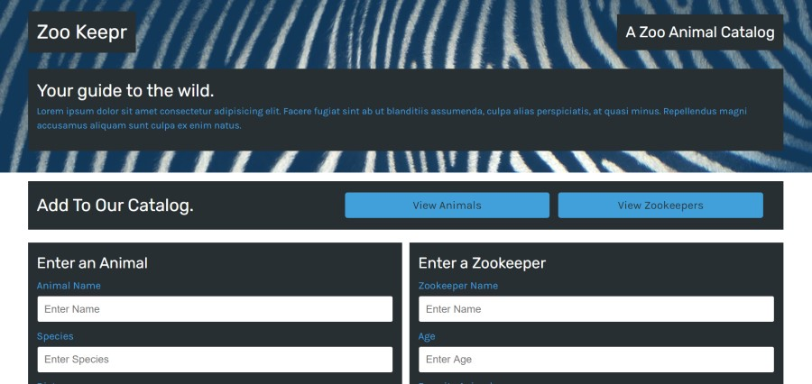

<h1 align="center">Zoo Keeper</h1>

<p align="center">


</p>

<p align="center">

</p>


## Table of Contents
- [Description](#description)
- [Installation](#install)
- [Usage](#usage)
- [Tests](#tests)
- [Demo and Repos](#Demo-and-Repo)
- [Questions](#questions)

## Description
This is a Demo Zoo site using Express server. The site uses routes to bring up JSON data already created, also giving the abilty to add animals and zoo keepers to the JSON data.

## Install
Clone repo then in root directory
```
npm install
```
## Usage
Once installed 
```
npm start
```
          
## Tests  
```
`npm run test`
```  

## Demo and Repo

### Below is a link to the GitHub repository   
[Zoo Keeper](https://github.com/mattkohl82/team-profile-generator)  

### Below is a link to the active site
[Heroku Site](https://murmuring-depths-40438.herokuapp.com/) 

## Questions
### [Mattkohl82 for GitHub](https://github.com/Mattkohl82)  
### mattkohl82@gmail.com for ✉️ email 

